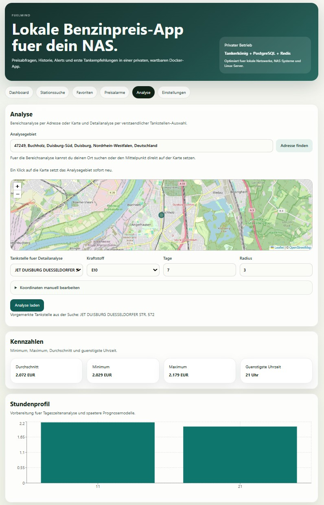
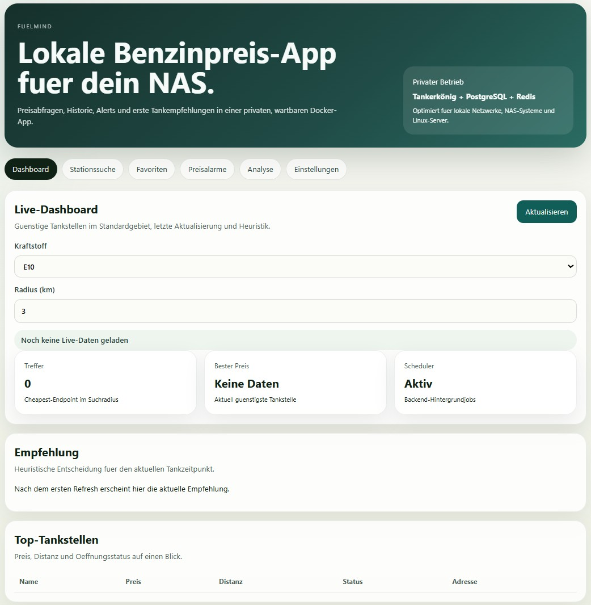
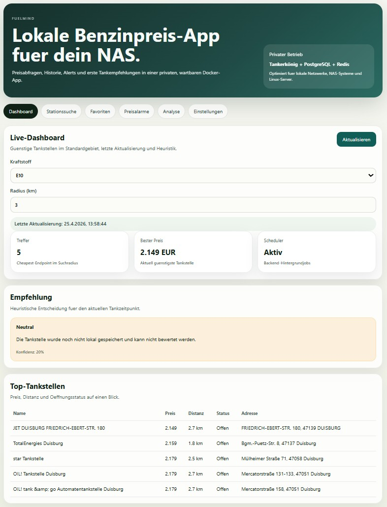
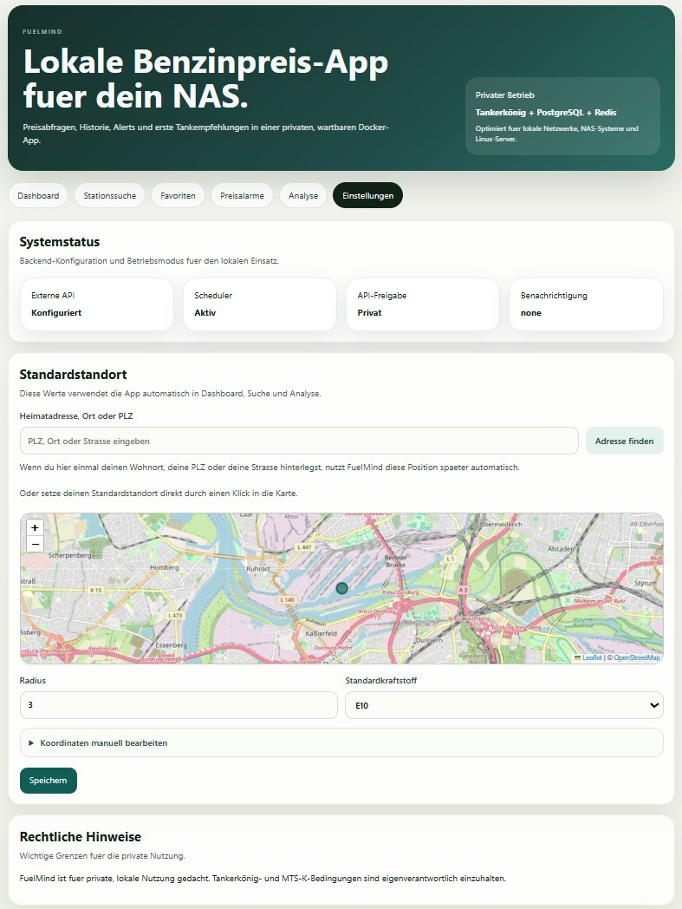
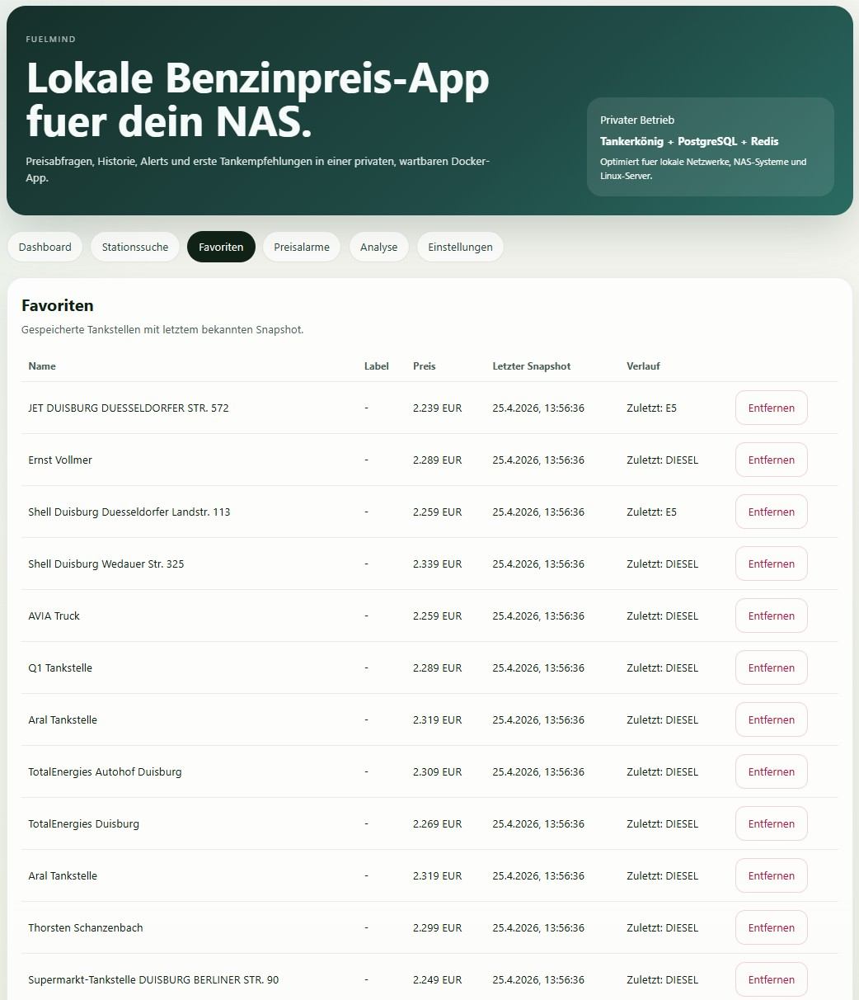
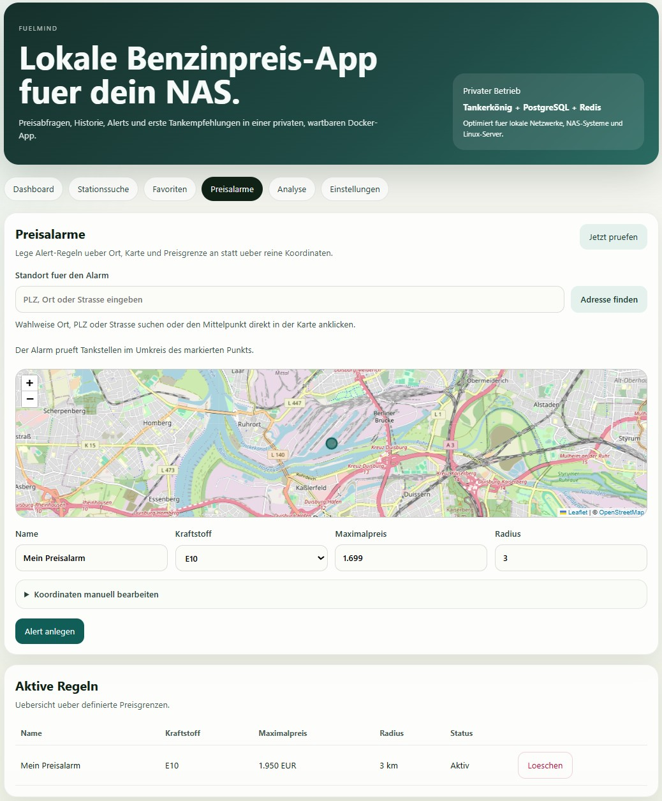
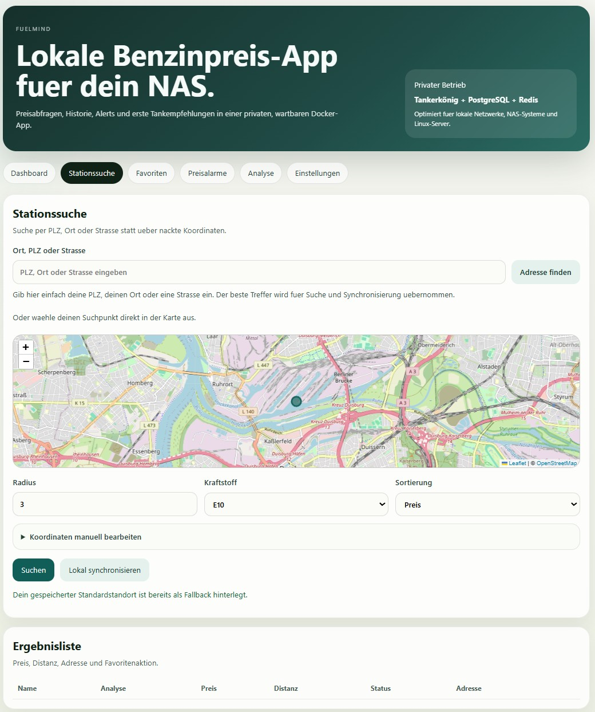

# FuelMind

FuelMind ist eine lokal betreibbare Benzinpreis-Intelligence-App fuer private Nutzung. Die Anwendung kombiniert aktuelle Tankerkönig-Abfragen mit lokaler Historisierung, Favoriten, Preisalarmen, heuristischen Empfehlungen und einer Docker-faehigen Architektur fuer NAS-Systeme wie UGREEN, Synology, QNAP oder generische Linux-Server.

## Funktionsumfang

- Aktuelle Preise fuer E5, E10 und Diesel abrufen
- Umkreissuche nach Tankstellen mit Preis- oder Distanzsortierung
- Tankstellen lokal speichern und Preis-Snapshots historisieren
- Favoriten verwalten und zyklisch aktualisieren
- Preisalarme definieren und intern protokollieren
- Dashboard fuer guenstige Tankstellen und Empfehlungen
- Historische Kennzahlen und guenstige Zeitfenster analysieren
- CSV-Importstruktur fuer spaetere historische Datenquellen vorbereiten
- Prognosemodul heuristisch vorbereiten und modular fuer spaeteres ML entkoppeln

## Architekturuebersicht

- `backend`: FastAPI, SQLAlchemy, APScheduler, Redis-Cache, Tankerkönig-Client
- `frontend`: React, Vite, TypeScript, Recharts
- `postgres`: PostgreSQL 16 mit PostGIS
- `redis`: Cache fuer API-Abfragen
- optional `adminer` und `grafana` ueber Compose-Profile

Mehr Details stehen in [docs/architecture.md](docs/architecture.md).

## Voraussetzungen

- Docker Engine mit Docker Compose Plugin
- gueltiger Tankerkönig-API-Key
- lokales oder privates Netzwerk fuer den Betrieb

## Installation

1. Projekt in ein Zielverzeichnis kopieren.
2. `.env.example` nach `.env` kopieren.
3. Tankerkönig-API-Key und ggf. Standardstandort eintragen.
4. Stack starten.

## `.env`-Konfiguration

Pflicht:

- `TANKERKOENIG_API_KEY`
- `POSTGRES_PASSWORD`

Wichtige Standardwerte:

- `ALLOW_PUBLIC_API=false`
- `ENABLE_SCHEDULER=true`
- `DEFAULT_LAT`
- `DEFAULT_LNG`
- `DEFAULT_RADIUS_KM=10`
- `DEFAULT_FUEL_TYPE=e10`
- `FRONTEND_API_BASE_URL=http://localhost:8000/api`

Optional:

- `APP_INTERNAL_TOKEN`
- `NOTIFICATION_MODE`
- `SMTP_*`
- `NTFY_TOPIC`
- `TELEGRAM_*`

## Docker-Start

```bash
docker compose up -d
docker compose logs -f backend
docker compose down
docker compose down -v
```

Auf dem NAS kannst du alternativ das Hilfsskript [fuelmind.sh](fuelmind.sh) nutzen:

```bash
bash fuelmind.sh
bash fuelmind.sh status
bash fuelmind.sh logs
bash fuelmind.sh stop
```

Wenn du auf dem NAS lieber direkt nur `fuelmind` tippen willst, installiere einmal den Wrapper aus [install-fuelmind-command.sh](install-fuelmind-command.sh):

```bash
bash install-fuelmind-command.sh
export PATH="$HOME/.local/bin:$PATH"
fuelmind
fuelmind status
```

Fuer Windows gibt es ausserdem das Synchronisationsskript [sync-to-nas.ps1](sync-to-nas.ps1), das den Projektordner nach `Z:\docker\fuelmind` kopiert:

```powershell
cd C:\Users\dietm\Documents\Codex\2026-04-21-du-bist-codex-und-arbeitest-als\fuelmind
powershell -ExecutionPolicy Bypass -File .\sync-to-nas.ps1
```

Standardverhalten:
- `.env` wird aus Sicherheitsgruenden nicht automatisch auf das NAS kopiert
- wenn du sie bewusst mitsynchronisieren willst:

```powershell
powershell -ExecutionPolicy Bypass -File .\sync-to-nas.ps1 -IncludeEnvFile
```

Danach auf dem NAS:

```bash
fuelmind rebuild
```

Optional:

- `docker compose --profile tools up -d adminer`
- `docker compose --profile observability up -d grafana`

## Nutzung

- Frontend: `http://localhost:3000`
- Backend/OpenAPI: `http://localhost:8000/docs`
- Healthcheck: `http://localhost:8000/api/health`

## Backend-Endpunkte

- `GET /api/health`
- `GET /api/stations/nearby`
- `GET /api/stations/{station_id}`
- `POST /api/stations/sync-nearby`
- `GET /api/prices/current`
- `GET /api/prices/history/{station_id}`
- `GET /api/prices/cheapest`
- `GET /api/favorites`
- `POST /api/favorites`
- `DELETE /api/favorites/{id}`
- `GET /api/alerts`
- `POST /api/alerts`
- `PUT /api/alerts/{id}`
- `DELETE /api/alerts/{id}`
- `POST /api/alerts/check-now`
- `GET /api/analytics/station/{station_id}`
- `GET /api/analytics/best-time`
- `GET /api/prediction/recommendation`
- `GET /api/settings`
- `PUT /api/settings/defaults`

Beispiele stehen in [docs/api.md](docs/api.md) und [scripts/example_requests.http](scripts/example_requests.http).

## Frontend-Nutzung

- Dashboard: guenstigste Tankstellen, Radius, Kraftstoffwahl, Empfehlung
- Stationssuche: gezielte Umkreissuche und Favoritenanlage
- Favoriten: letzte lokale Snapshots
- Preisalarme: Regeln anlegen und Historie einsehen
- Analyse: Stundenprofile und guenstige Zeitfenster
- Einstellungen: Standortdefaults, Scheduler-Status, Rechtshinweise

## Datenmodell

Die wichtigsten Tabellen:

- `stations`
- `price_snapshots`
- `price_changes`
- `favorite_stations`
- `alert_rules`
- `alert_events`
- `app_settings`

Details: [docs/data_model.md](docs/data_model.md)

## Scheduler

- `sync_favorites_prices`: alle 10 Minuten
- `check_alerts`: alle 5 Minuten
- `cleanup_old_cache`: taeglich
- deaktivierbar ueber `ENABLE_SCHEDULER=false`

Wichtig: Der Scheduler arbeitet nur auf Favoriten und expliziten Alert-Radien. Es gibt keine deutschlandweite Massenabfrage.

## Preisalarme

Alerts speichern Ereignisse zunaechst intern in PostgreSQL. Externe Benachrichtigungskanaele wie E-Mail, Telegram, `ntfy`, Pushover oder Home Assistant sind ueber ENV vorbereitet, aber in Version 0.1 noch nicht vollstaendig umgesetzt.

## Analyse- und Prognosekonzept

- Stundenprofile aus lokalen `price_snapshots`
- historische Min/Max/Durchschnittswerte
- guenstige Zeitfenster per Stundenaggregation
- heuristische Empfehlung `tank_now`, `wait` oder `neutral`

Beispielheuristik:

- `tank_now`, wenn aktueller Preis unter dem 25%-Quantil der letzten 7 Tage liegt
- `wait`, wenn der Preis deutlich ueber dem Durchschnitt liegt und spaeter historisch guenstigere Fenster auftreten
- `neutral`, wenn Datenlage oder Preisniveau uneindeutig sind

## Historische Daten / CSV-Import

Das Skript [scripts/import_historical_prices.py](scripts/import_historical_prices.py) ist als Adapterstruktur vorbereitet:

- `detect_format()`
- `validate_columns()`
- `parse_row()`
- `insert_batch()`

Hinweis: Das exakte CSV-Format haengt von der Quelle ab und muss vor echtem Produktiveinsatz geprueft oder erweitert werden.

## Rechtliche Hinweise / Datennutzung

- FuelMind ist fuer private, lokale Nutzung vorgesehen.
- Die Tankerkönig-AGB und die Bedingungen der MTS-K sind einzuhalten.
- Die Daten duerfen nicht automatisiert massenhaft abgefragt werden.
- Die Daten duerfen nicht an Mineraloelunternehmen, Tankstellenbetreiber oder fuer diese taetige IT-Dienstleister weitergegeben werden.
- Die bezogenen Datensaetze duerfen nicht als eigene API an Dritte weitergereicht werden.
- Die App ist kein Preissteuerungs- oder Preisoptimierungssystem fuer Tankstellen.
- Nutzerinnen und Nutzer sind selbst fuer die Einhaltung der Nutzungsbedingungen verantwortlich.

## Troubleshooting

- `health` zeigt `database=error`: PostgreSQL-Container, Zugangsdaten und Volumes pruefen
- `redis=error` oder `unavailable`: FuelMind laeuft weiter, aber ohne zentralen Cache
- `503` bei Stationssuche: API-Key, Internetzugang und Tankerkönig-Verfuegbarkeit pruefen
- Frontend erreicht Backend nicht: `FRONTEND_API_BASE_URL` und Port-Mappings pruefen
- Keine Empfehlungen: zuerst lokale Historie ueber Suche, Favoriten oder Scheduler aufbauen

## Tests

Backend-Tests laufen mit `pytest` und verwenden nur gemockte externe API-Daten.

```bash
cd backend
pytest
```

## Roadmap

Siehe [docs/roadmap.md](docs/roadmap.md).

## Wichtige Annahmen

- Tankerkönig-Endpunkte und Response-Mapping sind im Client gekapselt, damit spaetere API-Aenderungen leicht angepasst werden koennen.
- In Testumgebungen wird das Geofeld fuer SQLite portabel gespeichert; im Compose-Stack ist PostGIS aktiv.
- In Version 0.1 werden Alerts extern noch nicht zugestellt, sondern intern als Event-Historie gespeichert.

## Screenshots

<!-- screenshots:start -->

### Desktop









<!-- screenshots:end -->


